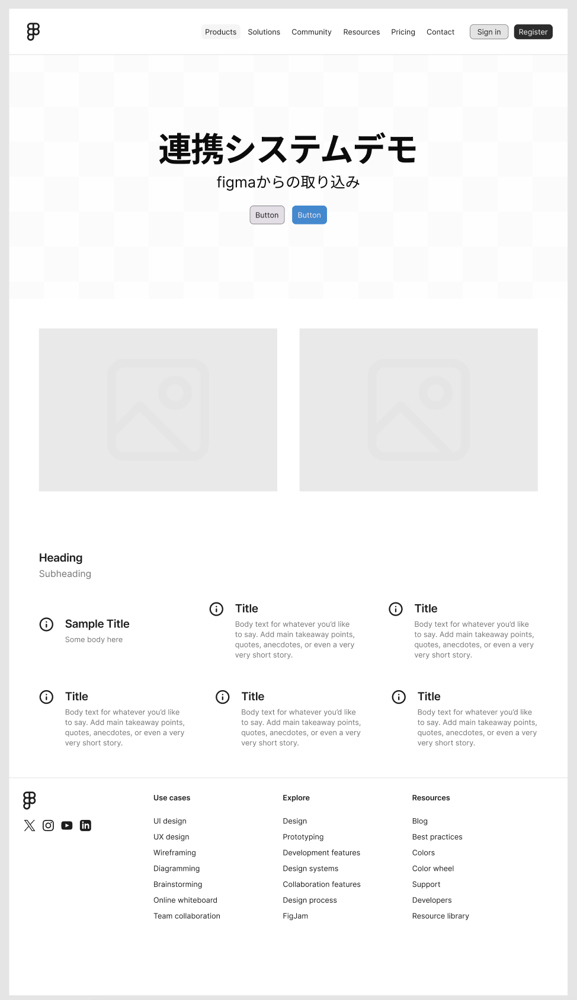
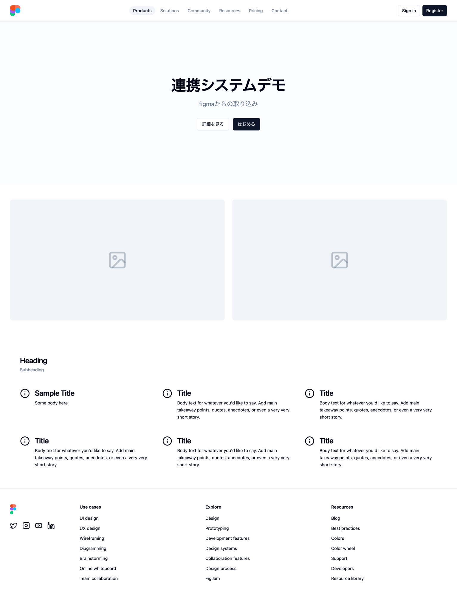

# design-system-demo

Figma のデザインファイルから React コンポーネント + Storybook ストーリーを **半自動生成** するデザインシステムのデモプロジェクトです。

---

## 概要

| | |
|:---:|:---:|
| **Figma デザイン（取り込み元）** | **React 実装（出力）** |
|  |  |

左が Figma 上のデザイン、右が生成された React コンポーネントをブラウザで表示したスクリーンショットです。  
デザイントークン（色・スペーシング・タイポグラフィ）を Tailwind CSS 変数にマッピングしながら、ほぼ同じ見た目を再現しています。

---

## 使用技術

| 技術 | 役割 |
|---|---|
| **React + TypeScript** | UI コンポーネント実装 |
| **Tailwind CSS** | スタイリング（CSS 変数トークンで管理） |
| **shadcn/ui** | Button などプリミティブコンポーネントの土台 |
| **Storybook** | コンポーネントカタログ・ドキュメント自動生成 |
| **Vitest** | ユニットテスト |
| **Vite** | ビルド・開発サーバー |
| **Docker** | 環境統一（node_modules をボリュームで管理） |

---

## 作業フロー

### 1. Figma MCP でデザインを読み取る

**Claude Code + Figma MCP サーバー** を使い、Figma ファイルのノード情報をコードから直接取得しました。

```
Figma MCP get_metadata  →  ページ構造・ノードID の把握
Figma MCP get_design_context  →  各セクションのコード参考・スクリーンショット取得
```

Figma ファイルは 1 ページ、5 つのセクションで構成されていました。

| セクション | 内容 |
|---|---|
| Header | ロゴ + ナビゲーション 6 項目 + Sign in / Register |
| Hero Image | タイトル・サブタイトル・ボタングループ |
| Panel Image Double | 画像プレースホルダー × 2 |
| Card Grid Icon | セクション見出し + アイコン付きカード × 6（3 列） |
| Footer | ロゴ + SNS アイコン + リンク列 × 3 |

### 2. トークンをマッピングしてコンポーネントを生成

Figma 独自の `--sds-*` トークンはプロジェクトに存在しないため、以下のようにプロジェクトの Tailwind トークンへ変換しました。

| Figma トークン | Tailwind クラス |
|---|---|
| `--sds-typography-title-hero-*` Bold | `text-5xl font-bold tracking-tight` |
| `--sds-typography-subtitle-*` Regular | `text-xl text-muted-foreground` |
| `--sds-typography-heading-*` SemiBold | `text-2xl font-semibold tracking-tight` |
| `--sds-typography-body-*` Regular | `text-sm text-foreground` |
| Button variant=Neutral | shadcn `variant="outline"` |
| Button variant=Primary | shadcn `variant="default"` |

マッピングできないトークン（チェッカーボードパターン、`#E3E3E3` など）は `// FIXME` コメントで明示し、人間の判断に委ねています。

### 3. shadcn/ui をベースに React コンポーネントを作成

生成したコンポーネント一覧：

```
src/components/
├── ui/button.tsx          # shadcn/ui Button（インストール済み）
├── NavigationPill/        # ナビゲーションピル（Active / Default 状態）
├── Header/                # ロゴ + ナビ + 認証ボタン
├── HeroSection/           # ヒーロー見出し + ボタングループ
├── PanelImageDouble/      # 2 パネル画像（プレースホルダー対応）
├── CardIconGrid/          # 3 列アイコンカードグリッド
└── Footer/                # ロゴ + SNS + リンク 3 列
```

各コンポーネントは `forwardRef` 対応・TypeScript 型定義必須の CLAUDE.md ルールに従っています。

### 4. Storybook ストーリーを生成

各コンポーネントに `ComponentName.stories.tsx` を自動生成。CSF3 形式で以下 3 カテゴリを必ず含めています。

| Story | 内容 |
|---|---|
| **Default** | Figma のデフォルト状態を再現 |
| **Variants** | props のバリエーション（size / variant / state 等） |
| **Edgecases** | 長文・空配列・disabled などの境界ケース |

`tags: ['autodocs']` により Storybook の Docs ページが自動生成されます。

### 5. `/figma` ルートで全体確認

`src/pages/FigmaPage.tsx` として全セクションを組み合わせたページを作成し、`http://localhost:5173/figma` でプレビューできるようにしました。

---

## 起動方法

```bash
# 初回セットアップ（Docker 起動 + npm install）
make setup

# 開発サーバー（http://localhost:5173）
make dev

# Storybook（http://localhost:6006）
make storybook

# テスト
make test
```

> **注意**: `npm install` はホスト側ではなく `make setup` でコンテナ内に実行してください。  
> Docker の `node_modules` はボリュームで管理されており、ホスト側とは独立しています。

---

## 各ツールの役割まとめ

```
Figma
  └─ MCP サーバー（get_metadata / get_design_context）
       └─ Claude Code
            ├─ ノード構造を解析・トークンマッピングを決定
            ├─ React + TypeScript コンポーネントを生成
            ├─ Tailwind CSS でスタイリング（トークン変換）
            └─ Storybook ストーリーを生成
                  └─ shadcn/ui Button をベースコンポーネントに使用
```

**Figma MCP** がデザインとコードをつなぐブリッジとして機能し、**Claude Code** がルール（CLAUDE.md）に従ってコンポーネントとストーリーを一括生成します。インタラクションや状態管理など AI が完全に自動化できない箇所は `// TODO` コメントで明示し、人間が手直しする前提としています。

---

## 手動対応が必要な箇所

生成コード内に以下のコメントが残っている箇所は人間による調整が必要です。

- `// FIXME` — Figma トークンをマッピングできなかった箇所（色・背景パターン等）
- `// TODO(手動)` — インタラクション・href・認証フロー等の実装
- `play` 関数 — Storybook インタラクションテストの雛形のみ
